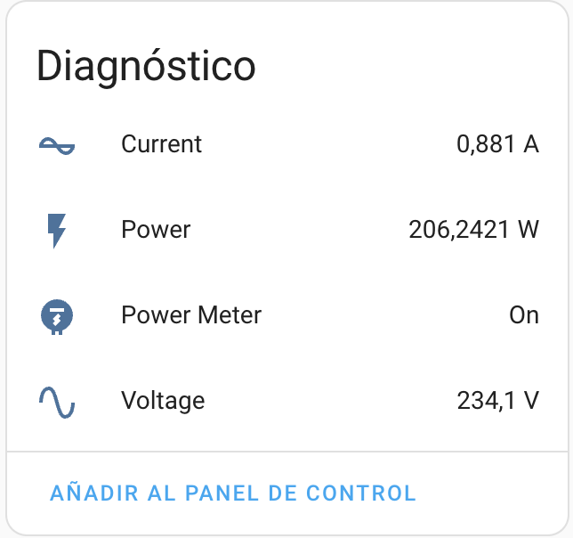

[![version][releases-shield]][releases]
[![hacs][hacsbadge]][hacs]
[![BuyMeCoffee][buymecoffeebadge]][buymecoffee]
[![PayPal.Me][paypalbadge]][paypal]

# Home Assistant integration for UTE (Uruguay)

:warning: **Disclaimer** :warning:  
*The use of the name "UTE" in this context does not imply any affiliation, endorsement, or association with UTE, its products or services. The use of the name is not intended to cause confusion or infringe upon UTE's intellectual property rights.*  
  
  

**This component will set up the following platforms.**

| Platform        | Description                                                               |
| --------------- | ------------------------------------------------------------------------- |
| `binary_sensor` | Show something `True` or `False`.                                         |
| `sensor`        | Show info from Ute API. |

## Features

- Display agreement information (contracted tariff, contracted voltage, contracted power peak, last month consumption, last month charge,...)
- Current status power meter (Current, Power, Voltage and Status)

## Installation

1. Using the tool of choice open the directory (folder) for your HA configuration (where you find `configuration.yaml`).
2. If you do not have a `custom_components` directory (folder) there, you need to create it.
3. In the `custom_components` directory (folder) create a new folder called `ute_energy`.
4. Download _all_ the files from the `custom_components/ute_energy/` directory (folder) in this repository.
5. Place the files you downloaded in the new directory (folder) you created.
6. Restart Home Assistant
7. In the HA UI go to "Configuration" -> "Integrations" click "+" and search for "Ute Energy"

Using your HA configuration directory (folder) as a starting point you should now also have this:

```text
custom_components/ute_energy/ute_energy.py
custom_components/ute_energy/coordinator.py
custom_components/ute_energy/sensor.py
custom_components/ute_energy/diagnostics.py
custom_components/ute_energy/__init__.py
custom_components/ute_energy/utils.py
custom_components/ute_energy/manifest.json
custom_components/ute_energy/strings.json
custom_components/ute_energy/exceptions.py
custom_components/ute_energy/binary_sensor.py
custom_components/ute_energy/translations
custom_components/ute_energy/translations/en.json
custom_components/ute_energy/const.py
custom_components/ute_energy/config_flow.py
```

## Configuration is done in the UI
#


<br/>


<br/>
<br/>




<!---->


<!---->
<br/>
<br/>

# To Do 
- Configure config flow


## Thanks To

- [api-ute](https://github.com/aronkahrs-us/api-ute) by [@aronkahrs-us](https://github.com/aronkahrs-us)

[![BuyMeCoffee][buymecoffeebadge]][buymecoffee]
[![PayPal.Me][paypalbadge]][paypal]

---
[buymecoffee]: https://www.buymeacoffee.com/gustavoqzdaa
[buymecoffeebadge]: https://img.shields.io/static/v1.svg?label=%20&message=Buy%20me%20a%20coffee&color=6f4e37&logo=buy%20me%20a%20coffee&logoColor=white
[hacs]: https://hacs.xyz
[hacsbadge]: https://img.shields.io/badge/HACS-Default-orange.svg?logo=HomeAssistantCommunityStore&logoColor=white
[releases-shield]: https://img.shields.io/github/manifest-json/v/gustavoqzdaa/ute_energy?filename=custom_components%2Fute_energy%2Fmanifest.json&color=green
[releases]: https://github.com/gustavoqzdaa/ute_energy/releases
[paypalbadge]: https://img.shields.io/static/v1.svg?label=%20&message=PayPal.Me&logo=paypal
[paypal]: https://paypal.me/gustavoqzdaa
